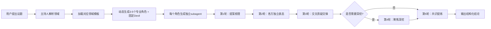

# RoundTable：通用多Agent圆桌讨论框架

RoundTable 是一个基于 Claude Code 多Agent能力的智能讨论框架，能够针对任意议题自动生成专业讨论阵容，通过多视角独立思考和结构化交锋，帮你获得更全面、更深入的决策参考。

## 🌟 核心特点

- **自动组局**：根据议题自动匹配领域、生成3-5个专业角色，每个角色是独立运行的subagent
- **张力设计**：角色之间天生存在观点冲突，避免"一边倒"的无效讨论
- **魔鬼代言人**：无论什么议题，必设Devil角色专门挑战所有默认假设，避免认知盲区
- **结构化流程**：严格的提案→表态→质疑→共识流程，确保讨论高效不跑题
- **多领域覆盖**：支持商业决策、技术选型、人生选择、学术研究、创意探索等几乎所有需要多角度思考的场景

## 🎯 适用场景

### 触发关键词
当你说这些词的时候会自动触发RoundTable：
> 圆桌讨论、开个会、讨论一下、评估一下、行不行、给我不同角度的意见、头脑风暴、roundtable、帮我想想

### 典型使用场景
- **商业决策**：产品方向、商业模式、市场策略、融资、定价、合伙
- **技术选型**：架构设计、技术栈选择、重构方案、性能优化
- **人生决策**：职业转型、移民、教育选择、重大生活决策
- **学术研究**：研究方向选择、论文构思、理论辩证
- **创意探索**：内容创作方向、品牌定位、营销方案
- **政策分析**：规则制定、项目评估、风险预判

## 🚀 使用方法

### 第一步：提出议题
直接说你想讨论的问题即可，比如：
> "我想讨论下是否要把我的开源项目商业化"
> "帮我评估下从大厂裸辞做独立开发的可行性"
> "讨论下这个新的微服务架构设计有什么问题"

### 第二步：确认阵容
系统会自动匹配领域、生成讨论阵容，你可以：
- 直接开始讨论
- 调整角色（比如"加一个法务视角"）
- 修改议题

### 第三步：参与讨论
讨论过程中你可以随时干预：
- `继续`：推进到下一轮讨论
- `聚焦 XXX`：让大家围绕某个具体话题深入
- `加人 XXX`：新增特定视角的角色
- `结束`：直接生成最终结论

## ⚙️ 运行机制



## 🎭 角色设计

每个角色都包含：
- **身份**：明确的角色定位，比如"产品经理"、"技术架构师"、"风险分析师"
- **温度**：15-30°C的温度值，代表说话的冷热程度，不同角色温度有差异
- **专业视角**：独特的思考维度，确保每个角色看问题的角度完全不同
- **张力点**：预先设计的冲突关系，确保观点碰撞足够充分
- **领域边界**：明确哪些问题不在角色职责范围内，避免越界发言

### 必选角色：Devil（魔鬼代言人）
无论什么议题，永远有一个Devil角色：
- 永远站在少数派一边，所有人支持就反对，所有人反对就支持
- 每次发言至少指出2个实质性漏洞
- 只质疑假设和观点，不攻击人
- 不同领域温度不同：商业/技术15°C（冷峻直接），人生决策18°C（诚恳直言）

## 📋 输出示例

### 讨论前阵容展示
```
📋 议题：是否应该从大厂裸辞做独立开发
🏷️ 领域：人生/个人决策

🪑 圆桌阵容：
• 【务实主义者】(20°C) — 算经济账、机会成本、可操作性
• 【理想主义者】(28°C) — 关注内心热情、长期愿景、意义感
• 【风险分析师】(16°C) — 分析最坏情况、可逆性、安全网
• 【未来的你】(22°C) — 站在10年后的视角看今天的选择
• 【Devil】(18°C) — 挑战所有人的假设

⚡ 设计张力：
  务实主义者 ↔ 理想主义者：现实收益 vs 精神满足
  风险分析师 ↔ 未来的你：当下风险 vs 长期后悔

调整阵容？还是开始？
```

### 最终结论格式
```
━━━━━━━━━━━━━━━━━━━━━━━━━━━━
📊 圆桌结论
━━━━━━━━━━━━━━━━━━━━━━━━━━━━

共识：
1. 你目前的储蓄足够支撑2年无收入，具备裸辞的基本条件
2. 你想做的产品方向有明确的付费用户群体，市场空间存在

分歧：
• 支持方（理想主义者、未来的你）：应该尽快裸辞，窗口期只有1年
• 反对方（务实主义者、风险分析师）：建议先兼职做6个月验证PMF

风险：
🔴 高 — 产品6个月内做不出收入的概率60%，可能会消耗大部分储蓄
🟡 中 — 长期独处可能导致社交能力退化，影响未来求职

┌─────────────────┐     ┌─────────────────┐
│   裸辞选项      │     │   兼职选项      │
├─────────────────┤     ├─────────────────┤
│  收益：最高     │     │  风险：最低     │
│  风险：最高     │     │  速度：最慢     │
│  适合：风险偏好  │     │  适合：风险厌恶  │
└─────────────────┘     └─────────────────┘

选项：
A. 立刻裸辞 — 适合愿意承担风险、追求快速试错的情况
B. 兼职6个月验证收入再辞职 — 适合追求稳妥、容错空间小的情况
C. 暂缓 — 先攒够3年生活费再考虑

━━━━━━━━━━━━━━━━━━━━━━━━━━━━
```

## 🎯 为什么用RoundTable？

### vs 自己思考
- 避免"当局者迷"，帮你看到自己忽略的角度
- 强迫你面对不愿意思考的风险和问题
- 结构化梳理思路，避免情绪主导决策

### vs 问朋友
- 朋友往往碍于情面不会说真话，Devil永远敢说最狠的真话
- 朋友的专业领域有限，RoundTable可以生成任意领域的专家视角
- 不会产生人情负担，想说什么就说什么

### vs 直接问AI
- 普通AI回答往往"和稀泥"，没有立场冲突，看不到不同观点的碰撞
- RoundTable每个角色独立思考，会有真实的观点交锋，更接近真实的讨论效果
- 不仅给结论，还给你不同立场的完整推理过程

## 📁 相关文件

- `domains.md`：各领域的角色模板定义
- `persona-guide.md`：角色人格写作指南
- `devil-protocol.md`：魔鬼代言人的详细规则
- `install.sh`：安装脚本
